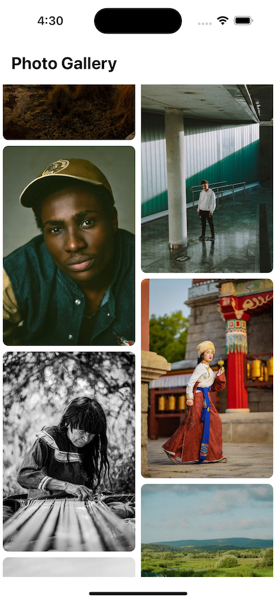
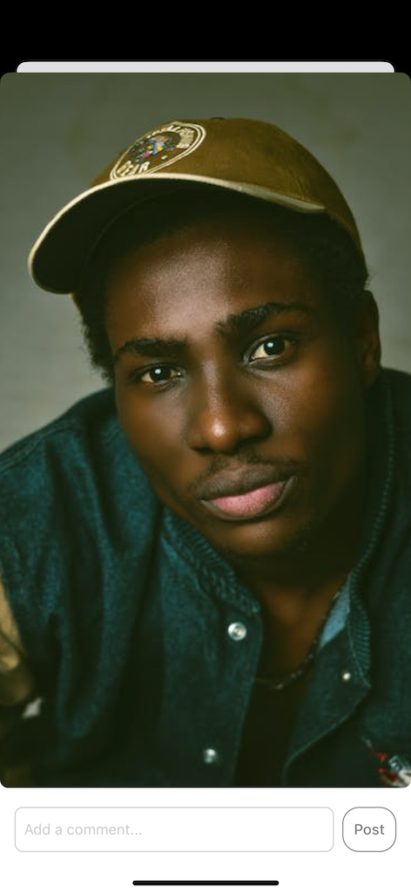

## Photo Gallery

A minimal photo gallery app previewing over 100 images.

All images were sourced from [Pexels](https://www.pexels.com/).

## Setting up development environment
- Clone the repository `git clone https://github.com/davidokonji/photo-gallery-rn.git`
- Run `yarn` to install dependencies

#### Running the IOS app
- install Xcode and open the project in Xcode
- run `npx pod-install` to install pods
- Run `yarn ios` to start the application

#### Running the Android app
- install Android Studio and open the project in Android Studio
- Run `yarn android` to start the application

#### Running tests
- Run `yarn test` to run tests

